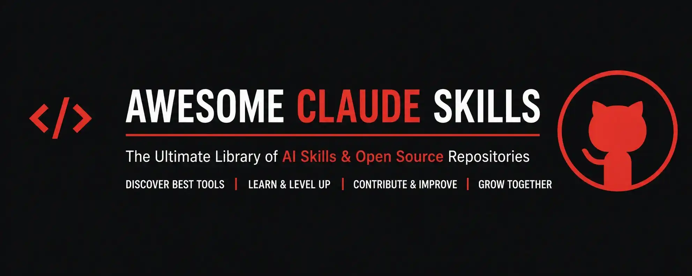

<p align="center">
  
</p>

<h1 align="center">Awesome-Claude_Skills</h1>

<p align="center">
  <strong>The canonical open-source documentation library for AI context optimization, token economy, memory systems, MCP servers, prompt engineering, and developer productivity tools.</strong>
</p>

<p align="center">
  <a href="LICENSE"></a>
  <a href="CONTRIBUTING.md"></a>
  <a href="schemas/metadata.schema.json"></a>
  <a href="docs/standards.md"></a>
</p>

---

## 📖 Overview

**Awesome-Claude_Skills** is a documentation-first repository containing curated open-source tools for AI coding optimization. It provides standardized, evidence-based documentation for Model Context Protocol (MCP) servers, persistent memory systems, prompt compression algorithms, codebase intelligence tools, and prompt engineering frameworks across all 13 canonical domain categories.

---

## 📚 Skills Library

### 🧠 [Memory](skills/memory/)

- [Mem0](skills/memory/mem0/)

---

### 📦 [Context](skills/context/)


---

### ⚡ [Context Compression](skills/context-compression/)


---

### 💰 [Token Optimization](skills/token-optimization/)

---

### ✍️ [Prompt Engineering](skills/prompt-engineering/)


---

### 🔍 [Codebase Intelligence](skills/codebase-intelligence/)


---

### 🔌 [Model Context Protocol (MCP)](skills/mcp/)


---

### 🚀 [Developer Productivity](skills/developer-productivity/)

---

### 🔄 [Agent Workflows](skills/agent-workflows/)


---

### 🛡️ [Security](skills/security/)


---

### 📊 [Evaluation](skills/evaluation/)


---

### 🧪 [Testing](skills/testing/)


---

### 🔭 [Observability](skills/observability/)


---

## 🏷 Browse by Problem

Find the appropriate category based on your immediate engineering bottleneck:

| Technical Problem / Need | Go To Category |
| :--- | :--- |
| **Reduce Token Usage** | [Context Compression](skills/context-compression/README.md) |
| **Reduce API Costs** | [Token Optimization](skills/token-optimization/README.md) |
| **Improve Memory & State Retention** | [Memory](skills/memory/README.md) |
| **Understand Large Codebases** | [Codebase Intelligence](skills/codebase-intelligence/README.md) |
| **Connect External Tools & APIs** | [Model Context Protocol (MCP)](skills/mcp/README.md) |
| **Improve Prompt Design & Schemas** | [Prompt Engineering](skills/prompt-engineering/README.md) |
| **Improve AI Reasoning & Planning** | [Agent Workflows](skills/agent-workflows/README.md) |
| **Secure Tool Usage & Guardrails** | [Security](skills/security/README.md) |
| **Evaluate Prompt Quality & Benchmarks** | [Evaluation](skills/evaluation/README.md) |
| **Test AI Workflows & Assertions** | [Testing](skills/testing/README.md) |
| **Observe Token Usage & Telemetry** | [Observability](skills/observability/README.md) |

---

## 📂 Repository Structure

```text
Awesome-Claude_Skills/
│
├── README.md                          <- Root Landing Page & Central Documentation Hub
├── LICENSE                            <- Documentation License (CC BY 4.0)
├── MIT.txt                            <- Tooling, Templates & Schemas License (MIT)
├── CONTRIBUTING.md                    <- Contributor Guide & Submission Workflow
├── CODE_OF_CONDUCT.md                 <- Community Covenant Code of Conduct (v2.1)
├── SECURITY.md                        <- Security Policy & Vulnerability Disclosure
├── CHANGELOG.md                       <- Release History & Architectural Decison Log
├── .gitignore                         <- Comprehensive Exclusion Rules
│
├── .github/
│   ├── PULL_REQUEST_TEMPLATE.md       <- PR Review Checklist
│   └── ISSUE_TEMPLATE/
│       ├── new_tool_request.yml       <- Structured Tool Request Form
│       └── tool_update.yml            <- Tool Metadata Update Form
│
├── assets/
│   └── Banner.webp                    <- High-Resolution Banner Image
│
├── docs/
│   ├── taxonomy.md                    <- Canonical 13-Category Domain Taxonomy
│   ├── glossary.md                    <- AI Context & Optimization Glossary
│   └── standards.md                   <- Documentation Standards & Quality Metrics
│
├── schemas/
│   └── metadata.schema.json           <- Machine-Readable Draft-07 JSON Schema
│
├── templates/
│   ├── README.template.md             <- Standardized 28-Section Tool README Template
│   ├── metadata.template.json         <- JSON Metadata Starter Template
│   └── workflow.template.mmd          <- Mermaid Architecture Diagram Template
│
└── skills/                            <- 13 Canonical Domain Category Directories
    ├── memory/                        <- Memory Systems & Persistent State Retention
    │   └── mem0/                      <- Mem0 Complete Documentation Package
    │       ├── README.md              <- Overview, Statistics & SDK Quickstart
    │       ├── guide.html             <- Interactive Technical & Architecture Guide
    │       ├── metadata.json          <- Machine-Readable Tool Metadata
    │       └── LICENSE                <- Apache-2.0 License File
    ├── context/                       <- Context Window Assembly & Token Packing
    ├── context-compression/           <- Prompt & Context Compression Algorithms
    ├── token-optimization/            <- Token Economy & API Cost Reduction
    ├── prompt-engineering/            <- System Prompts & Structured Schemas
    ├── codebase-intelligence/         <- Codebase Indexing & AST Symbol Graphs
    ├── mcp/                           <- Model Context Protocol Servers & Gateways
    ├── developer-productivity/        <- Workflow Automation & IDE Extensions
    ├── agent-workflows/               <- Multi-Agent Swarms & Sequential Reasoning
    ├── security/                      <- AI Guardrails, Privacy & Tool Safety
    ├── evaluation/                    <- Prompt Quality & LLM Benchmarking
    ├── testing/                       <- Assertion Frameworks & Agent Testing
    └── observability/                 <- Telemetry, Token Tracing & Cost Monitoring
```

### Directory Responsibilities

- **`skills/`**: The core documentation library, containing standardized documentation packages organized across 13 canonical domain categories.
- **`docs/`**: Core repository knowledge infrastructure, providing authoritative specifications for category taxonomy, technical glossary definitions, and quality standards.
- **`templates/`**: Production-ready starter templates (`README.template.md`, `metadata.template.json`, `workflow.template.mmd`) enforced for all tool contributions.
- **`schemas/`**: Formal Draft-07 JSON Schema (`metadata.schema.json`) enabling automated validation, machine indexing, and programmatic querying by AI coding agents.
- **`assets/`**: High-resolution visual branding assets, architectural diagrams, and repository banners.
- **`.github/`**: Automation workflows, issue templates (`new_tool_request.yml`, `tool_update.yml`), and pull request submission guidelines.

### Individual Tool Specifications

Every tool documented under `skills/<category>/<tool-slug>/` adheres strictly to a standardized 4-file documentation package specification:

```text
skills/<category>/<tool-slug>/
│
├── README.md              <- Authoritative overview, GitHub badges, statistics, & quickstart
├── guide.html             <- Comprehensive interactive technical guide (Architecture, Comparison, FAQ)
├── metadata.json          <- Machine-readable metadata matching schemas/metadata.schema.json
└── LICENSE                <- Skill-level open-source license file
```

- **`README.md`**: Provides immediate 30-second developer discovery, project statistics, problems solved, compatibility matrix, and installation options.
- **`guide.html`**: Delivers a full, responsive interactive technical manual featuring SVG architecture diagrams, multi-language SDK examples, vector store configuration tables, and troubleshooting steps.
- **`metadata.json`**: Enables instant parsing of tool properties (category, license, subcategory, primary languages, repository stats) by AI agents and indexers.
- **`LICENSE`**: Preserves exact upstream license compliance for every documented tool.

Category-level summaries, tool comparisons, star counts, and learning pathways are maintained inside each category's [`README.md`](skills/memory/README.md) file.

---


## 🤝 Contributing

We welcome contributions for open-source AI optimization tools and MCP servers!

1. Select the appropriate category under `skills/<category>/`.
2. Copy `templates/README.template.md` and `templates/metadata.template.json` to your tool directory.
3. Validate `metadata.json` against `schemas/metadata.schema.json`.
4. Submit a Pull Request following [.github/PULL_REQUEST_TEMPLATE.md](.github/PULL_REQUEST_TEMPLATE.md).

For complete submission criteria and writing guidelines, read [CONTRIBUTING.md](CONTRIBUTING.md).

---

## 🗺 Roadmap & FAQ

### Roadmap

- [x] Establish canonical 13-category architecture and schema standards.
- [x] Launch standardized 28-section tool documentation templates.
- [ ] Expand tool documentation coverage across all 13 categories to 100+ open-source tools.
- [ ] Implement automated CI workflows for link checking and SVG/PDF validation.
- [ ] Launch interactive web search index powered by `metadata.json`.

### FAQ

**Q: Is this repository an AI coding assistant software library?**  
A: No. **Awesome-Claude_Skills** is a documentation-first repository. It provides standardized guides, schemas, diagrams, and metadata for open-source AI optimization tools.

**Q: Why are tool rankings and star counts omitted from the root README?**  
A: To maintain a clean, scalable landing page. Tool comparisons, star metrics, and recommendation tables belong inside category `README.md` files where they can be evaluated in domain context.

**Q: Can proprietary tools be documented?**  
A: No. We exclusively document open-source projects, open protocols (like MCP), and open standards.

**Q: How do I add a new tool?**  
A: Review [CONTRIBUTING.md](CONTRIBUTING.md), copy the templates in `templates/`, and submit a Pull Request.

---

## 📄 License

This repository uses a dual licensing model:

- **Documentation & Content**: Licensed under [Creative Commons Attribution 4.0 International (CC BY 4.0)](LICENSE).
- **Schemas, Templates & Tooling**: Licensed under the [MIT License](MIT.txt).

See [LICENSE](LICENSE) for full licensing boundaries.
